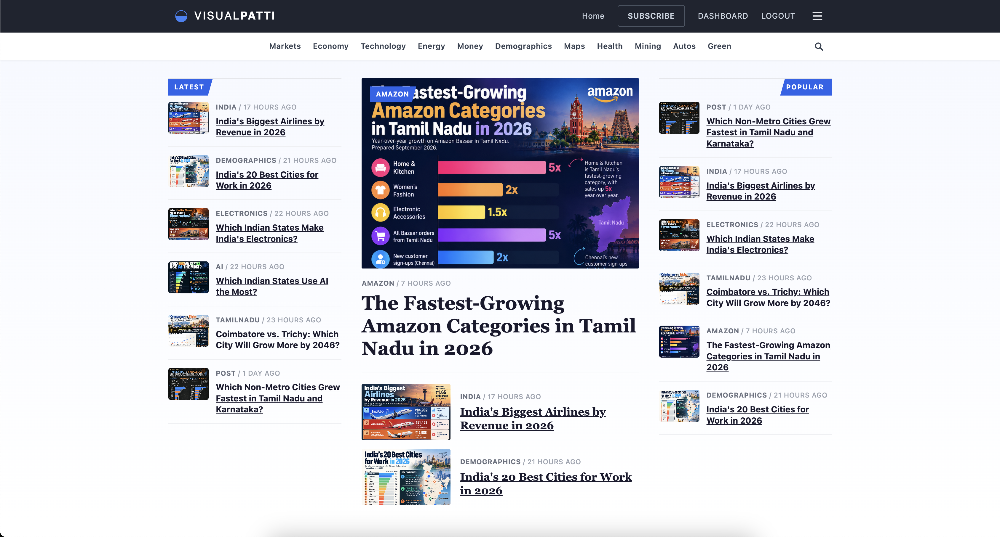

Title: Meet VisualPatti: A Visual Village for the World Beyond the Headlines
Date: 2026-09-30
Category: Product Launch
Tags: VisualPatti, VisPa, Data Visualization, Kactii, Student Builders, Open Contribution
Slug: meet-visualpatti-a-visual-village
Status: Published
Cover: image/2026-09-30-meet-visualpatti-a-visual-village/1790733815664-opt.jpg

## A Village Made of Visuals

In Tamil, *patti* means village. A village is a place where everyone knows each other, where stories are shared freely, and where anyone can walk in and sit down at the common table. That is the spirit behind our newest product at Kactii: **VisualPatti**, or **VisPa** for short.

VisualPatti is a visual village. It is a place where data, facts, and details are turned into clear, beautiful visuals that anyone can understand in seconds. Markets, economies, energy, health, demographics, mining, autos, green technology: if it can be measured, it can be visualized, and if it can be visualized, it belongs in the village.

You can explore it today at [visualpatti.com](https://www.visualpatti.com/).

## Why the World Needs More Visual Stories

We live in an age of too much information and too little understanding. A single report on inflation, population change, or electric vehicle adoption can run for hundreds of pages. Most people will never read it. But show them one well-designed chart, and the story lands instantly.

Visuals are the fastest bridge between raw data and real understanding. A good visual respects the reader's time. It does not ask for patience; it rewards curiosity. That is why visual storytelling has become one of the most powerful forms of communication on the internet.

## Inspired by Visual Capitalist

We want to be honest about where the idea came from. VisPa is inspired by **Visual Capitalist**, one of the best-known names in data visualization. Their work has shown millions of people that numbers can be beautiful and that complex topics can be made simple.

But as we spent more time with that kind of content, two gaps became clear to us.

**Geographic Focus**
A large share of mainstream visual content centres on the United States: its markets, its companies, its economy. That makes sense for their audience, but it leaves much of the world under-told.

**Barrier to Entry**
Becoming a contributor to established visual platforms can feel out of reach for newcomers. Talented young designers and analysts often have great ideas but no easy door to walk through.

VisualPatti exists to fill both gaps.

## Looking Beyond One Country

The world is far bigger than one economy. How is India's solar capacity growing district by district? How do remittances shape household income in the Philippines? What does the mining map of Africa really look like? How are Tamil Nadu's manufacturing clusters changing? How does Canada's immigration mix compare decade to decade?

These are stories that deserve beautiful visuals too, and they are rarely told well. At VisPa, we are deliberately exploring non-US content: South Asia, Southeast Asia, Africa, Latin America, Europe, and everywhere in between. We are not against any country's stories. We simply believe every country has stories worth seeing.

## A Door That Is Always Open

The heart of any village is its people. That is why VisualPatti is built to be simple for newcomers.

**Easy Contribution**
If you can create a meaningful visual from real data, you can contribute. No long gatekeeping process, no insider network required.

**Community First**
VisPa is a space to share stories, images, and updates from the community. Contributors are neighbours, not applicants.

**Room to Grow**
A student making their first chart and an experienced analyst publishing a deep-dive can sit side by side in the same village.

We believe the next great data storyteller might be a first-year college student in Coimbatore, a young analyst in Manila, or a self-taught designer in Nairobi. They just need a place to begin.

## Built With 17-Year-Old College Students

This is the part we are most proud of. VisualPatti was built by Kactii together with a team of 17-year-old college students.

They were not just helpers on the side. They designed pages, shaped the categories, tested the contributor flow, and questioned our assumptions at every step. Their energy and fresh eyes made the product better than it would have been otherwise.

At Kactii, we believe young builders learn best by shipping real products to real users. VisPa is proof of that belief. A group of students who were in school just a year ago have now helped launch a live platform on the open internet. That is the kind of learning no classroom can fully replicate.

## What You Will Find Inside

VisualPatti is organized into clear categories so readers can find what they care about quickly.

**Markets and Money**
Stock trends, currencies, household finance, and how money moves around the world.

**Economy and Demographics**
Growth, jobs, population shifts, migration, and the forces shaping societies.

**Technology and Energy**
Innovation, AI, power generation, and the energy transition.

**Maps**
Geography told through data: where things are, and why it matters.

**Health, Mining, Autos, and Green**
Focused tracks on sectors that shape everyday life and the planet's future.

Readers can subscribe to receive new visuals straight to their inbox, and contributors get their own dashboard to manage what they publish.

## How to Join the Village

There are three simple ways to be part of VisualPatti.

**Read and Share**
Visit the site, explore the visuals, and share the ones that teach you something new.

**Subscribe**
Get fresh visuals on the trends that matter delivered to your inbox.

**Contribute or Partner**
Create visuals and publish them on VisPa, or reach out through the Partner With Us page if your organization wants to collaborate.

## Why Kactii Built This

Kactii is an agentic AI company, so people sometimes ask why we built a visual storytelling platform. The answer is simple: AI makes it easier than ever to gather and analyse data, but humans still need to *understand* it. Visuals are where understanding happens.

VisPa is also part of our larger mission to give young builders real-world experience. Every product we build with students becomes both a useful tool for the world and a training ground for the next generation of engineers and creators.

## The Road Ahead

This is just the beginning. Over the coming months, we plan to grow the contributor community, add more region-focused visual series, and make it even easier for first-time creators to publish their work.

A village grows one house at a time. VisualPatti will grow one visual at a time, and one contributor at a time.

## Come Sit at the Common Table

If you love data, design, or simply understanding the world better, there is a place for you in the visual village.

Visit [visualpatti.com](https://www.visualpatti.com/), explore, subscribe, and if you have a story to tell, tell it visually.

Welcome to VisualPatti. Welcome to the village.